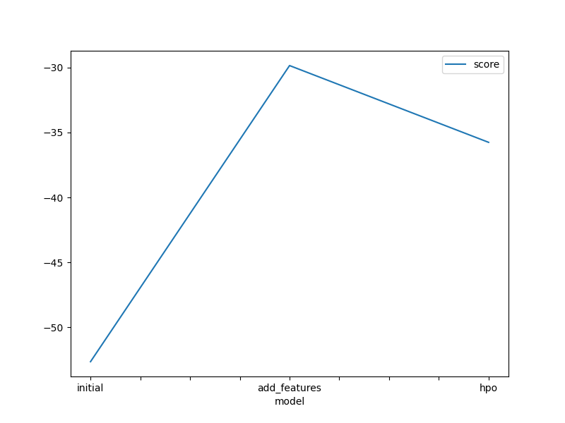
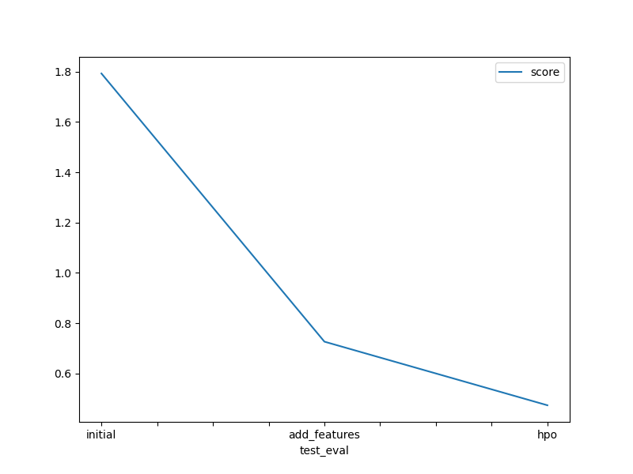

# Report: Predict Bike Sharing Demand with AutoGluon Solution
#### NAME HERE
Hoang-Phuong NGUYEN

## Initial Training
### What did you realize when you tried to submit your predictions? What changes were needed to the output of the predictor to submit your results?
Firstly, we need to prevent any negative values in our predictions, if there is any, set them to zero.
Next, we need to guarantee to submit the predictions in a corect format required by Kaggle competition. 

### What was the top ranked model that performed?
My top ranked trained model was WeightedEnsemble_L3, which had obtained a public score of 0.47327 in the Kaggle competition.

## Exploratory data analysis and feature creation
### What did the exploratory analysis find and how did you add additional features?
The EDA results showed that the data had some category features, such as datetime, which were not good features for training the regression model.
I have separated the datetime feature into 3 numerical features, including: month, day and hour by using Pandas datetime functions.  

### How much better did your model preform after adding additional features and why do you think that is?
The publicScore before adding additional features: 1.79308.
The publicScore after adding additional features: 0.72634.(improve the accuracy up to 246%)

## Hyper parameter tuning
### How much better did your model preform after trying different hyper parameters?
The publicScore before optimizing hyperparamters: 0.72634.
The publicScore after optimizing hyperparamters: 0.47327.(improve the accuracy up to 153%)

### If you were given more time with this dataset, where do you think you would spend more time?
I would like to further analyze the features and select the optimal ones for training the predictor while removing inrrelevant features. 

### Create a table with the models you ran, the hyperparameters modified, and the kaggle score.
|model|learning_rate|activation|dropout_prob|score|
|--|--|--|--|--|
|initial|default|default|default|1.79308|
|add_features|default|default|default|0.72634|
|hpo|0.0005|relu|0.1|0.47327|

### Create a line plot showing the top model score for the three (or more) training runs during the project.

### Create a line plot showing the top kaggle score for the three (or more) prediction submissions during the project.

## Summary
In this project, AutoGluon has been used to build several time series forecasting models for the Bike Sharing Demand competition in Kaggle. The Tabular Prediction is used to fit data from CSV files provided by the competion. An EDA is applied to explore the data features and new additional features are also generated for better performance. An hyperparameter optimization is used to improve the performance of the predictors and the best performance is achieved at 0.47327 of the Kaggle publicScore. 